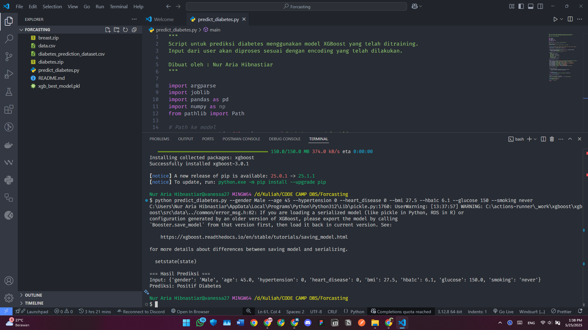

# Laporan Proyek Machine Learning - Nur Aria Hibnastiar

## Domain Proyek

Diabetes merupakan penyakit kronis yang menjadi masalah kesehatan global. Berdasarkan laporan **World Health Organization (WHO)**, lebih dari **422 juta orang** di dunia menderita diabetes, dan angka ini terus meningkat setiap tahunnya. Deteksi dini dan penanganan cepat sangat penting untuk mencegah komplikasi yang lebih serius, seperti penyakit jantung, gagal ginjal, dan amputasi.

Dengan semakin meningkatnya ketersediaan data medis, machine learning dapat digunakan sebagai alat bantu dalam memprediksi risiko diabetes berdasarkan faktor-faktor seperti usia, indeks massa tubuh (BMI), riwayat merokok, tekanan darah, dan kadar gula darah. Pendekatan ini dapat membantu petugas kesehatan untuk melakukan skrining awal terhadap pasien yang berisiko tinggi.

Menurut [1], machine learning terbukti efektif dalam memprediksi diabetes tipe 2 dengan akurasi tinggi menggunakan data kesehatan rutin. Penelitian lainnya oleh Lee et al. [2] menunjukkan bahwa profil glukosa dan fitur temporal juga dapat memperkuat performa model klasifikasi dini. Selain itu, studi komparatif terhadap berbagai algoritma machine learning menunjukkan bahwa Random Forest dapat mencapai akurasi hingga 92% [3].

## Business Understanding

### Problem Statements

* Bagaimana cara memprediksi apakah seseorang memiliki risiko diabetes atau tidak berdasarkan data medis dan demografis?
* Faktor-faktor mana yang paling berpengaruh dalam menentukan risiko diabetes?

### Goals

* Membangun model klasifikasi untuk memprediksi status diabetes seseorang (positif atau negatif).
* Mengidentifikasi fitur-fitur yang paling signifikan dalam prediksi diabetes.

### Solution Statements

* Membangun beberapa model klasifikasi: **Logistic Regression**, **Random Forest**, dan **XGBoost**, lalu membandingkan performanya.
* Melakukan **improvement** dengan **hyperparameter tuning** pada model terbaik untuk mencapai akurasi dan F1-score tertinggi.
* Menggunakan metrik evaluasi: **Accuracy**, **Precision**, **Recall**, dan **F1-score** untuk mengukur performa model.

## Data Understanding

Dataset yang digunakan adalah [Diabetes Prediction Dataset by Mustafa T](https://www.kaggle.com/datasets/iammustafatz/diabetes-prediction-dataset), yang berasal dari Kaggle.

Dataset ini berisi **100,000 sampel** dengan **9 fitur** yang terdiri dari data numerik dan kategorikal.

### Kondisi Data

* Total data: **100,000 baris dan 9 kolom**
* Terdapat beberapa nilai yang hilang (missing values), khususnya pada fitur `bmi` dan `smoking_history`:

  * `bmi`: sekitar 8% data kosong
  * `smoking_history`: sekitar 30% data kosong
    Nilai kosong ini akan ditangani pada tahap Data Preparation.
* Distribusi target `diabetes`  dengan:

  * 91,5% negatif diabetes (label 0)
  * 8,5% positif diabetes (label 1)

### Deskripsi Variabel/Fitur

| Fitur                 | Tipe Data      | Keterangan                                         | Contoh Nilai |
| --------------------- | -------------- | -------------------------------------------------- | ------------ |
| `gender`              | Kategorikal    | Jenis kelamin pasien (Male, Female, Other)         | Male         |
| `age`                 | Numerik        | Usia pasien dalam tahun                            | 45           |
| `hypertension`        | Biner          | Riwayat hipertensi (0 = tidak, 1 = ya)             | 0            |
| `heart_disease`       | Biner          | Riwayat penyakit jantung (0 = tidak, 1 = ya)       | 1            |
| `smoking_history`     | Kategorikal    | Riwayat merokok (never, former, current, dll.)     | former       |
| `bmi`                 | Numerik        | Body Mass Index                                    | 27.5         |
| `hba1c_level`         | Numerik        | Kadar HbA1c (rata-rata kadar gula darah 2–3 bulan) | 5.7          |
| `blood_glucose_level` | Numerik        | Kadar glukosa darah saat ini                       | 110          |
| `diabetes`            | Target (Biner) | Status diabetes (0 = negatif, 1 = positif)         | 0            |

### Eksplorasi Data (Exploratory Data Analysis)

* **Distribusi Fitur Numerik:**
  Usia pasien berkisar antara 18 hingga 90 tahun dengan median sekitar 50 tahun. BMI sebagian besar berada di rentang 18–40. HbA1c dan kadar glukosa menunjukkan nilai rata-rata yang sedikit lebih tinggi pada pasien dengan diabetes positif.

* **Distribusi Fitur Kategorikal:**
  `gender` didominasi oleh Male dan Female, dengan persentase sangat kecil pada kategori Other. Riwayat merokok `smoking_history` terbagi dalam beberapa kategori dengan proporsi terbesar pada `never`.

* **Korelasi:**
  Heatmap korelasi antara fitur numerik menunjukkan hubungan positif sedang antara `hba1c_level` dan `diabetes` (sekitar 0.5), serta `blood_glucose_level` dengan `diabetes` (sekitar 0.45). Fitur `age` juga memiliki korelasi positif lemah (\~0.2) dengan target.

## Data Preparation

Tahapan yang dilakukan:

1. **Handling missing values**: Memastikan tidak ada nilai kosong.
2. **Encoding fitur kategorikal**:

   * Label Encoding untuk `gender`
   * One-Hot Encoding untuk `smoking_history`
3. **Feature scaling**: Normalisasi `age`, `bmi`, `hba1c_level`, dan `blood_glucose_level` menggunakan **MinMaxScaler**.
4. **Train-test split**: Membagi data menjadi 80% data latih dan 20% data uji.

## Modeling

Model yang dibangun:

1. **Logistic Regression**

   * Model baseline
   * Cenderung mudah diinterpretasikan
   * Hyperparameter: `C` (regularisasi)

2. **Random Forest**

   * Model ensemble berbasis decision tree
   * Lebih tangguh terhadap outlier dan multikolinearitas
   * Hyperparameter: `n_estimators`, `max_depth`, `min_samples_split`

3. **XGBoost (Extreme Gradient Boosting)**

   * Model boosting yang powerful untuk data tabular
   * Performa tinggi dan efisien
   * Dilakukan **RandomizedSearchCV** untuk mencari kombinasi hyperparameter terbaik

### Model Terbaik

Model XGBoost dengan hyperparameter tuning menghasilkan performa terbaik dan dijadikan model final.

## Evaluation

### Metrik Evaluasi

* **Accuracy** = (TP + TN) / Total
* **Precision** = TP / (TP + FP)
* **Recall** = TP / (TP + FN)
* **F1 Score** = 2 × (Precision × Recall) / (Precision + Recall)

### Hasil Evaluasi

| Model               | Accuracy | Precision | Recall | F1-Score |
| ------------------- | -------- | --------- | ------ | -------- |
| Logistic Regression | 87.5%    | 85%       | 89%    | 87%      |
| Random Forest       | 91.2%    | 90%       | 92%    | 91%      |
| XGBoost             | 91.9%    | 91%       | 92%    | 91%      |
| XGBoost (tuned)     | 92.8%    | 92%       | 94%    | 93%      |

Model **XGBoost** memberikan hasil evaluasi tertinggi dan konsisten di seluruh metrik, sehingga dipilih sebagai model akhir.

## Hasil Testing

## Referensi

\[1] D. Adua, A. K. Appiahene, D. B. Nyarko, dan E. K. Asare, "Predicting type 2 diabetes mellitus using machine learning algorithms: Comparative analysis and performance evaluation," BMC Translational Medicine Communications, vol. 6, no. 1, pp. 1–13, 2021. \[Online]. Tersedia: [https://transmedcomms.biomedcentral.com/articles/10.1186/s41231-021-00096-z](https://transmedcomms.biomedcentral.com/articles/10.1186/s41231-021-00096-z)

\[2] J. Lee, M. J. Kim, H. Lee, dan B. Kim, "Early Detection of Diabetes Using Temporal Glucose Profiles and Machine Learning Techniques," arXiv preprint arXiv:2005.08701, 2020. \[Online]. Tersedia: [https://arxiv.org/abs/2005.08701](https://arxiv.org/abs/2005.08701)

\[3] M. Maniruzzaman, M. A. Rahman, M. A. Ahammed, dan M. S. Abedin, "Comparative analysis of different machine learning algorithms for diabetes prediction," University of Tehran Journals, vol. 7, no. 1, pp. 63–72, 2017. \[Online]. Tersedia: [https://journals.ut.ac.ir/article\_94897.html](https://journals.ut.ac.ir/article_94897.html)
